# 1. Crea un repositorio en GitHub, que sea público y que tenga al profesor como colaborador directo del repositorio. Crea un README.md donde plantees los siguientes puntos:
## Nombre del proyecto:
### TAREAPI

## Descripción detallada de los documentos que intervendrán en el proyecto, así como sus campos.

* ### Usuario --> El usuario que se logeara en la base de datos y se pueda asignar,borrar o actualizar una tarea si es dueño de la propia tarea o administrador
- _id : String?
- username: String
- password: String
- email: String
- direccion: Direccion
- roles: String = "USER"

* ### Direccion --> La direccion del usuario
- calle:String
- num:String
- municipio:String
- provincia:String
- cp:String

* ### Tarea --> La tarea que se vaya a asignar al usuario
- _id : String?
- titulo: String
- texto: String
- estado: Boolean
- fecha_inicio: Date
- usuario: Usuario

# 2. En el README anteriormente construido deberás incluir lo siguiente (aparte de lo ya descrito)
## a. Indicar los endpoints que se van a desarrollar para cada documento.
## b. Describir cada uno de los endpoints. Realiza una explicación sencilla de cada endpoint.

### /users
- POST → /login → Autenticar un usuario y generar un token JWT.
- POST → /register → Registra un nuevo usuario si no esta en la base de datos
- GET → /getInfo → Obtiene la información del usuario y tareas del usuario
- PUT → /asignarTarea/{idTarea} → Retirar dinero
- DELETE → /deleteUser/{username} → Eliminar usuario

## /tareas
- GET → /getInfoTarea/{idTarea} → Obtiene la informacion de una tarea
- POST → /crearTarea → Crea una tarea
- PUT → /modTarea/{idTarea} → Modifica el titulo o el texto de una tarea
- PUT → /completarTarea/{idTarea} → Completa como marcada una tarea
- DELETE → /delTarea/{idTarea} → Elimina una tarea

## c. Describe la lógica de negocio que va a contener tu aplicación.

## d. Describe las excepciones que vas a generar y los códigos de estado que vas a poner en todos los casos.
- 400 → Bad request → La información de la request no son válidos
- 401 → Unauthorized → El acceso no está autorizado
- 403 → Forbidden → El acceso necesita admin
- 404 → Not found → No encuentra algo en la base de datos
- 409 → Conflict → Se intenta insertar algo que ya está en la base de datos

## e. Describe las restricciones de seguridad que vas a aplicar dentro de tu API REST
- Todos los endpoints a excepción de login y register requieren de JWT, cada usuario requerirá de un token para acceder a los endpoints que requieren autorización
- Roles, aparte del jwt si intentas acceder a un endpoint que requiere el admin debes de tener el role
- Bcrypt, la contraseña entra a la base de datos encriptada
- En cada endpoint que se ha creado se valida la información

# PRUEBAS GESTION DE USUARIOS

- Iniciar sesion con un usuario existente
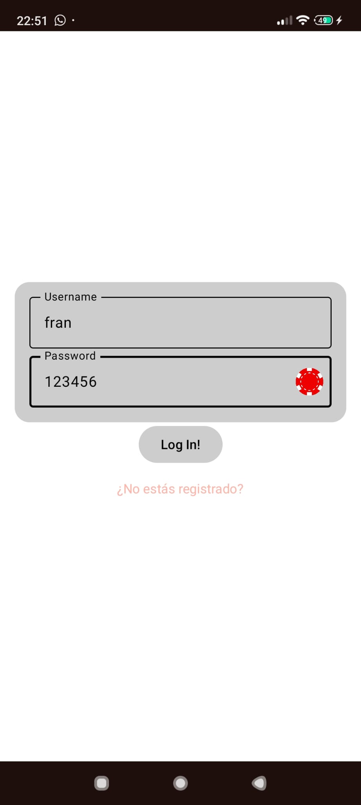
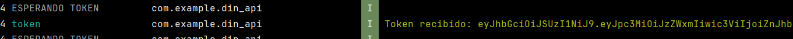
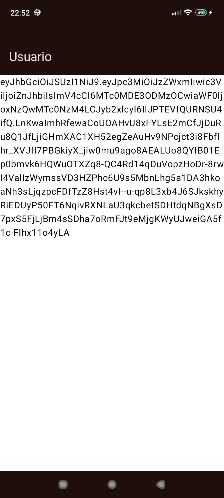
- Iniciar sesion con credenciales incorrectas
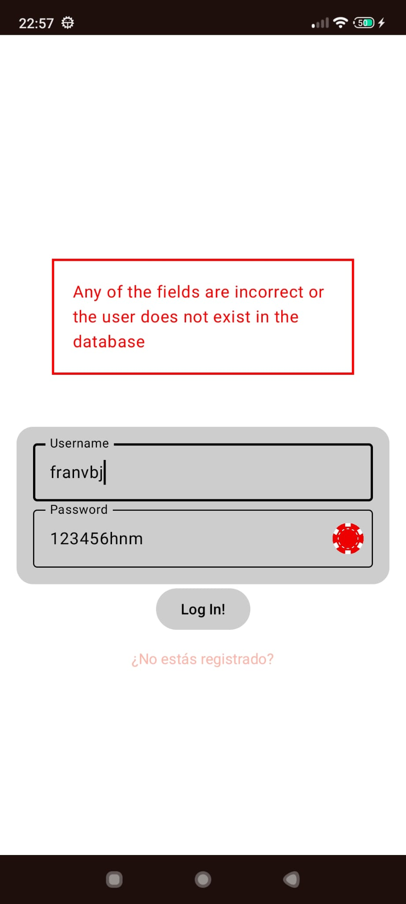
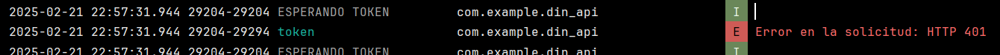
- Registrarse correctamente
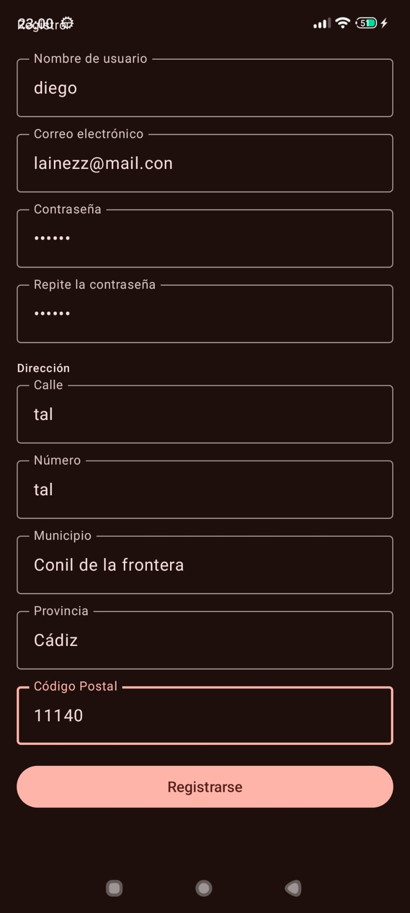
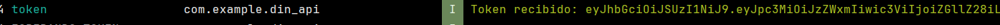
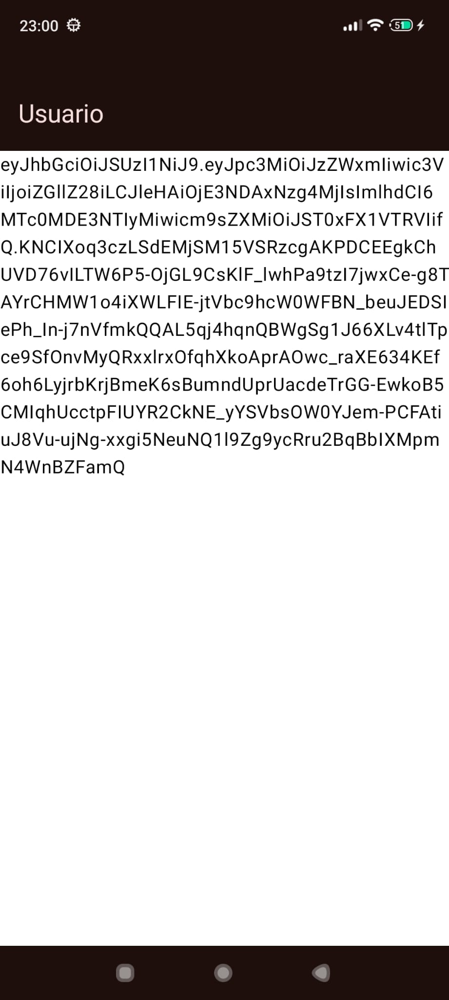
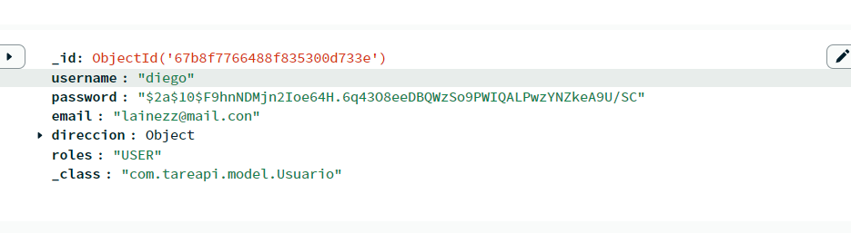
- Registro incorrecto
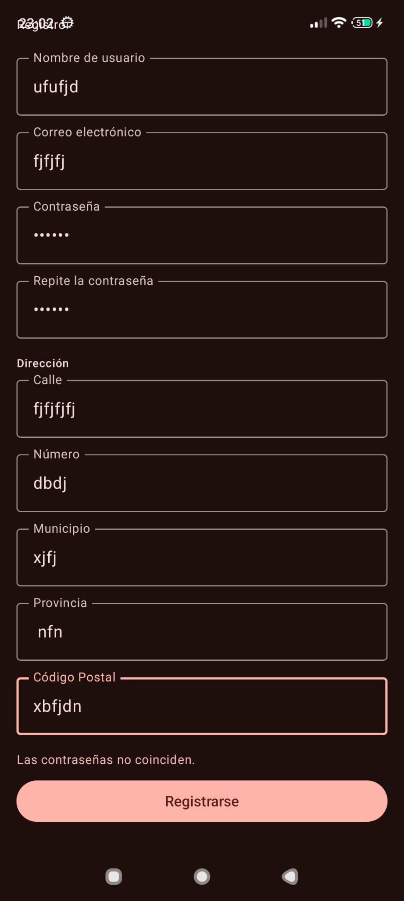
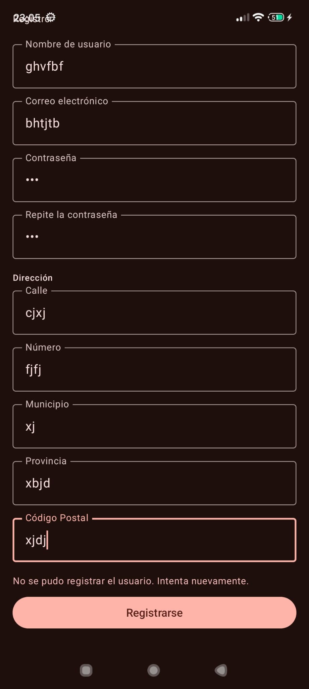
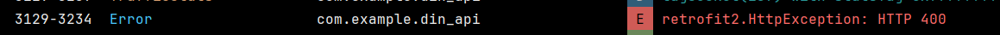

- videos demostrando el funcionamiento 
- https://drive.google.com/file/d/1u-fG6bRFW7P0V1mL9h0HFCUSNWxk0N31/view?usp=sharing
- https://drive.google.com/file/d/1Znc8UbSSNjrjdEDooLWrA_4seVOkr9OA/view?usp=sharing